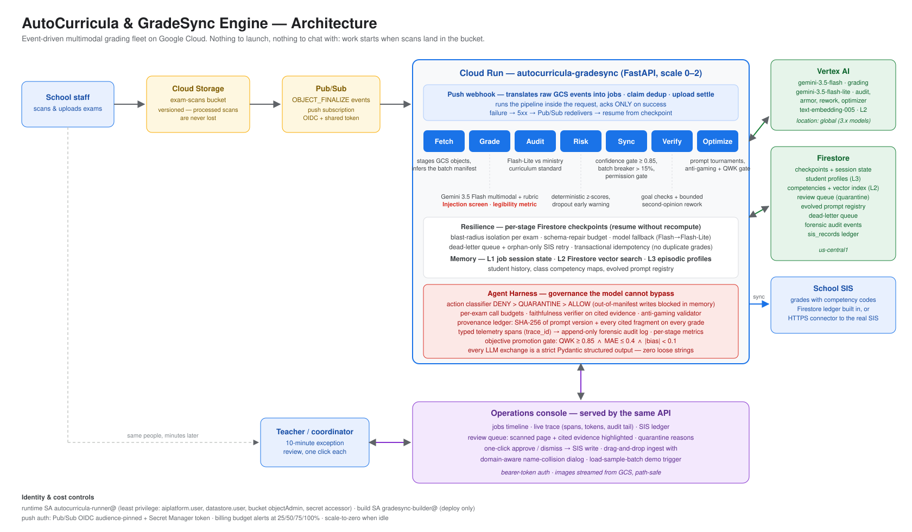
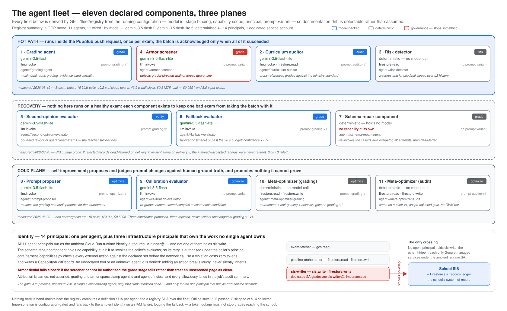
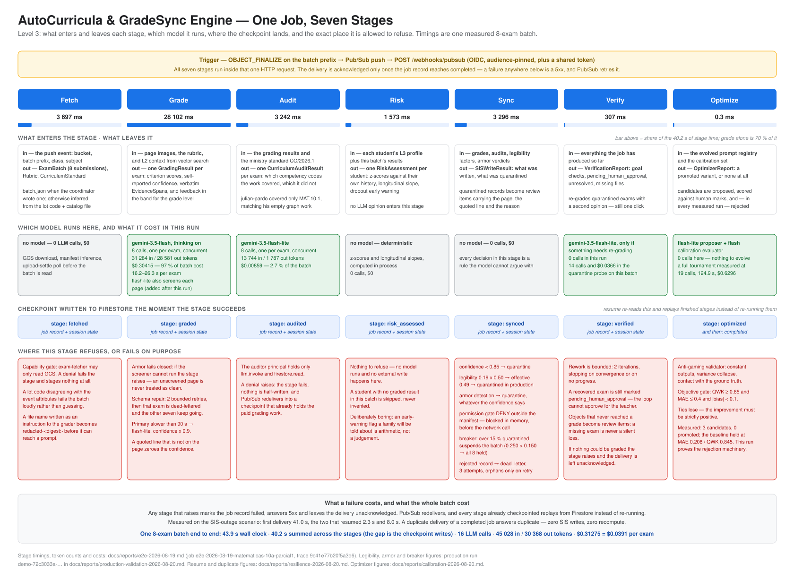

# AutoCurricula & GradeSync Engine

**[▶ Watch the 4-minute demo](https://youtu.be/m3yK7J8G5Ko)** — one teacher, three
sections, 108 handwritten exams. 96 reach the school gradebook with nobody
involved; the 12 the fleet refuses to decide are the only ones she sees.

### Two defects found in Google's own libraries, reported with reproductions

Building this hit two real bugs upstream. Both were filed with a minimal
reproduction, and we stayed on them.

| Issue | What it was | Where it stands |
|---|---|---|
| [`google/adk-python#6836`](https://github.com/google/adk-python/issues/6836) | `LlmAgent` rejects `temperature=` with `extra_forbidden`, and no discoverable path to `generate_content_config` | **Fixed and closed** by the ADK team, 28 Aug 2026 — we verified the fix against four edge cases |
| [`googleapis/python-genai#2889`](https://github.com/googleapis/python-genai/issues/2889) | Vertex structured output silently returns **empty** dict-typed fields; the call succeeds, no error, no warning | Acknowledged by the maintainers, internal bug filed |

Our own write-ups, with the reproductions and the workarounds we shipped:
[ADK temperature](docs/upstream/adk-llmagent-temperature.md) ·
[Vertex dict fields](docs/upstream/vertex-structured-output-dict-fields.md) ·
[the design argument we made](docs/upstream/6836-design-review.md) ·
[our re-test of their fix](docs/upstream/6836-retest.md)

---

[](docs/media/architecture.svg)

Teachers in K-12 schools spend **4.6 hours a week** hand-grading exams — the
OECD's own measurement, [TALIS 2024](https://www.oecd.org/en/publications/results-from-talis-2024_90df6235-en/full-report/the-demands-of-teaching_0e941e2f.html),
of a 41-hour working week. Feedback reaches students late — in the schools we
work with, typically a week or two after the exam — and every grade is retyped
into the SIS by hand.
Across Latin America's public systems that adds up to millions of unpaid evening
hours and feedback that arrives too late to matter. GradeSync deletes that work:
scans go into a bucket; **audited, evidence-cited grades appear in the school
system minutes later**, with dropout alerts and curriculum coverage maps as
by-products. No chat, no app to learn — the engine runs 100% in the background,
triggered by Cloud Storage uploads, and escalates to a human only when it should
not decide alone.

## The fleet

[](docs/media/fleet.svg)


Twelve components behind a single governing harness — eight model-backed agents
and four deterministic ones (risk scoring, schema repair, and the two
meta-optimizers, which orchestrate model calls without holding a model of their
own). Built with the
Google Agent Development Kit on Gemini 3.5 Flash (deep multimodal reasoning,
thinking enabled) and Gemini 3.5 Flash-Lite (high-speed structured extraction):

| # | Agent | Model | Role and pattern |
|---|---|---|---|
| 1 | Grading agent | Flash | Multimodal rubric grading of handwritten pages, parallel fan-out per exam, evidence spans cited verbatim |
| 2 | Curriculum auditor | Flash-Lite | Cross-references every grade against the ministry standard |
| 3 | Risk detector | deterministic | Dropout early warning from z-scores and longitudinal slopes — math, not opinion |
| 4 | Armor screener | Flash-Lite | Injection screen: detects handwritten prompt injection and forces quarantine |
| 5 | Second-opinion evaluator | Flash-Lite | Bounded rework loop over quarantined exams (human-in-the-loop stays in charge) |
| 6 | Fallback evaluator | Flash-Lite | Model failover on timeout or resource exhaustion, confidence discounted |
| 7 | Schema repair component | deterministic | Bounded self-repair loop: re-invokes the caller's own evaluator with a corrective instruction, then dead-letters. Holds no model and no capability of its own |
| 8 | Prompt proposer | Flash-Lite | Mutates grading prompts for the tournament |
| 9 | Calibration evaluator | Flash | Re-grades human-scored samples to score each candidate prompt |
| 10–11 | Meta-optimizers (grading, audit) | — | Tournament selection with adversarial anti-gaming validation and a composite objective gate (QWK ≥ 0.85 ∧ MAE ≤ 0.4 ∧ \|bias\| < 0.1) — a **promotion threshold, not a measured result**: see below |
| 12 | Evidence transcriber | Flash-Lite | Second independent reading of every scanned page, so the quotes the grader cited are checked against a reading that never saw the grade |

`GET /fleet/registry` builds this catalog at boot and says, per field, whether
it read the value from the running configuration or from the declaration.
Derived: model ids, runtime binding, the bound prompt variant and its content
hash — so a model swapped in the environment shows up here without anyone
editing a table. Declared: stage bindings, capability scope and the identity
principal. The endpoint reports `field_sources` for exactly this reason; the
operations console renders it as a Fleet panel.

The harness around them is deterministic and cannot be argued with: permission
gate (DENY > QUARANTINE > ALLOW), circuit breakers,
checkpoint resume, provenance ledger, typed telemetry. Every LLM call and every
inter-component message is a strict Pydantic v2 structured output — zero loose
strings.

## Elevator pitch

In goes a batch of scanned exams; out come audited grades in the SIS, curriculum
coverage maps, and early dropout alerts. Teachers don't "use" an app or learn an
interface: they drop files in a bucket and get their evenings back. Pure backoffice
infrastructure.

**Design targets** (measure against your own baseline in the first term):
teacher time from the 4.6 weekly hours of manual grading measured above to zero transcription and
~10 minutes of exception review; time-to-feedback from a 14-day grading cycle
to under 10 minutes after the scan lands in the bucket.

### Input flows

| Input | Source | Frequency |
|-------|--------|-----------|
| Scanned exam batch (handwritten PDFs/images) | Teacher or front office | Per assessment |
| Batch metadata (subject, grade, active rubric) | **Auto-inferred from the path/lot-code convention** or explicit `batch.json` | Automatic per event |
| Rubrics + national curriculum standard | Pedagogical coordination | Once per term |
| Calibration samples (human ground truth) | Validated historical assessments | Periodic (feeds self-improvement) |
| SIS/LMS credentials & connectors | IT / administration | One-time setup |

### Fundamental guarantees

1. **Transactional idempotency** — even if Pub/Sub delivers the message multiple
   times, an exam is never duplicated or computed twice in the SIS.
2. **Absolute defensibility** — every grade carries an `EvidenceSpan` with a verbatim
   quote and page number; parent complaints are answered with evidence from the
   student's own manuscript.
3. **Confidence-threshold escalation** — ambiguous answers or illegible handwriting
   are never guessed: they go to quarantine (`REQUIRES_HUMAN_REVIEW`) with the exact
   page and cited excerpt pre-highlighted, for one-click teacher approval.
4. **Deterministic, explainable risk** — early-warning alerts come from math
   (z-scores, longitudinal slopes over L3 history), not free-form LLM opinion.
5. **Anti-gaming self-improvement** — the prompt optimizer only promotes variants
   that improve human agreement (QWK/MAE), actively blocking variance collapse or
   artificial average-to-middle scores.
6. **Injection screen** — every graded page is screened for handwritten prompt
   injection (instructions addressed to the grader rather than student work);
   a detection forces the record into quarantine with the quoted attempt as
   the first review reason, regardless of confidence.
7. **Legibility-aware confidence** — a deterministic image-quality metric
   (Laplacian blur variance x contrast) discounts the model's self-reported
   confidence on degraded scans, so illegible pages quarantine even when the
   model claims certainty.
8. **Long-running fault tolerance** — persistent per-stage checkpoints; if
   infrastructure is interrupted, the pipeline resumes exactly at the pending stage
   without recomputing prior work.

## What it does

1. **Ingest** — A school uploads a batch of scanned handwritten exams / PDFs to a GCS
   bucket. GCS notifies Pub/Sub; Pub/Sub pushes the event to the Cloud Run service.
2. **Grade** — The grading agent (Gemini 3.5 Flash) performs multimodal OCR and rubric
   semantic assessment, producing criterion-level scores with cited evidence spans.
3. **Audit** — The curriculum auditor (Gemini 3.5 Flash-Lite) cross-references results
   against ministry curriculum competencies.
4. **Detect risk** — The risk detector scores anomalies and retention early-warning
   signals from episodic student history.
5. **Sync with confidence gate** — Records whose extraction confidence is at or above
   `GRADESYNC_CONFIDENCE_THRESHOLD` (default 0.85) with cited evidence are written
   into the SIS. Anything below the threshold, or scored without evidence, is
   quarantined as `REQUIRES_HUMAN_REVIEW` — never guessed, never silently synced —
   with the page, the cited excerpt, and the proposed record ready for one-click
   approval.
6. **Verify (agentic closure)** — A goal verifier checks the job's mission
   (every submission graded, audited and risk-assessed; SIS write clean; every
   quarantine accounted for) and runs a **bounded rework loop**: quarantined
   submissions are re-graded by a second-opinion evaluator; those that clear the
   gate get their review item updated with the new record and rework notes — still
   pending one-click human approval. The loop stops on convergence, no-progress,
   or the iteration budget (`GRADESYNC_VERIFY_MAX_ITERATIONS`), and reports
   `pending_human_approval` vs `unresolved` explicitly.
7. **Evolve** — Meta-optimizers (one per evolving prompt: grading and curriculum
   auditor) run **convergence loops of tournaments**: each cycle proposes
   `GRADESYNC_OPTIMIZER_CANDIDATES` mutations, re-evaluates every candidate against
   the same human ground-truth calibration set, gates them with the anti-gaming
   validator (variance collapse, constant outputs, ground-truth contact), promotes
   only the best accepted mutation — and keeps cycling until the marginal
   improvement falls below
   `GRADESYNC_OPTIMIZER_CONVERGENCE_MIN_IMPROVEMENT` or the cycle budget
   (`GRADESYNC_OPTIMIZER_MAX_CYCLES`) is exhausted.

   **This is the cold loop, and it does not run in the deployed demo.** A
   tournament needs the human-labelled calibration set on disk, and the container
   ships without one, so the stage records itself as skipped and the job
   continues. The measured run is
   [`docs/reports/calibration-2026-08-20.md`](docs/reports/calibration-2026-08-20.md);
   reproduce it with `python scripts/run_calibration.py`. We would rather say
   this than let a judge open the Optimizer panel and find zero cycles behind a
   paragraph promising tournaments.

## Architecture

[](docs/media/pipeline.svg)


A rendered diagram lives at [`docs/media/architecture.svg`](docs/media/architecture.svg).

```text
  +---------------+  upload batch   +--------------+  notification  +---------------------+
  | School Staff  |--------------->| | GCS Bucket  |-------------->| | Pub/Sub Topic      |
  +---------------+  (scans/PDFs)  +--------------+  (object       | | exam-batch-ingest  |
                                    (notify config)   finalize)    +----------+----------+
                                                                       push (OIDC + token)
                                                                         |
                                                                         v
                         +-----------------------------------------------+-----------------+
                         | Cloud Run Service  (scale 1-4, timeout=900, ack-on-success)      |
                         | FastAPI + uvicorn + uvloop + httptools, Pydantic v2 everywhere    |
                         |                                                               |
                         |   api/main.py       health + readiness endpoints               |
                         |   api/webhooks.py   Pub/Sub push handler -> PubSubJobEvent     |
                         +-------------------------------+-------------------------------+
                                                         |
                            ADK orchestration graph  (core/orchestration)
                                                         |
         +--------------------+--------------------+-----+---------------+-----------------+
         |                    |                    |                     |                 |
         v                    v                    v                     v                 v
  +---------------+  +-----------------+  +-----------------+  +----------------+  +---------------+
  | GCS Fetcher   |  | Grading Agent   |  | Curriculum      |  | Risk Detector  |  | SIS Connector |
  | (tools/)      |  | Gemini 3.5      |  | Auditor         |  | Gemini 3.5     |  | (tools/, httpx)|
  | stage objects |  | Flash multimodal|  | Gemini 3.5      |  | Flash-Lite     |  | grade writes  |
  | to local disk |  | OCR + rubric    |  | Flash-Lite      |  | anomaly +      |  | to SIS API    |
  +---------------+  | semantics       |  | cross-reference |  | early warning |  +---------------+
                     +-----------------+  +-----------------+  +----------------+
         |                    |                    |                     |                 |
         +--------------------+---------- L1/L2/L3 memory hierarchy ------+-----------------+
                                                         |
                                    state checkpoints -> Firestore (every step, resumable)
                                                         |
                                                         v
                                          +----------------------------+
                                          | Meta-Optimizer Agent       |
                                          | calibration vs human       |
                                          | ground truth, prompt       |
                                          | mutation, anti-gaming      |
                                          | validator                  |
                                          +----------------------------+
```

## Memory hierarchy

| Tier | Name | Backend | Contents | Lifetime |
|------|------|---------|----------|----------|
| L1 | Working memory / session state | In-process ephemeral store | Execution-graph context per Pub/Sub job: staged file refs, intermediate graded artifacts, checkpoints | Duration of one job |
| L2 | Vector search / short-term | Firestore vector search + Vertex text-embeddings (`GRADESYNC_EMBEDDING_MODEL`); local mode uses a real TF-IDF index | Dynamic rubrics, curriculum guideline chunks, batch-level calibration samples | Cross-job semantic retrieval |
| L3 | Managed cloud memory | Firestore | Episodic student profiles, cross-term class competency snapshots, evolved prompt registry | Persistent |

Every GCP client (Pub/Sub, Firestore, GCS, SIS) sits behind a Protocol with a real
local implementation selected when `GRADESYNC_LOCAL_MODE=true`, so the entire test
suite runs offline with no GCP credentials (in-memory stores, local-dir staging,
jsonl append).

## What the numbers do and do not say

The objective gate above is the bar a candidate prompt must clear to **replace**
the one in production. It is not a score we have achieved.

- Our best measured run is **QWK 0.845, MAE 0.208, bias −0.042** over 12
  criterion scores from 4 exams —
  [`docs/reports/calibration-2026-08-20.md`](docs/reports/calibration-2026-08-20.md),
  which states plainly that it **fails the gate by 0.005**. Nothing has been
  promoted, and the report says why.
- The 95% confidence interval on that QWK is
  [0.53, 0.96]
  ([`docs/architecture/limits-adversarial-review.md`](docs/architecture/limits-adversarial-review.md)).
  Four exams is a small sample and we treat it as one.
- [`tests/harness/golden_baseline.json`](tests/harness/golden_baseline.json) is
  **not** that measurement. It pins a deterministic lexical proxy so a refactor
  cannot silently move scoring; its own QWK is negative by construction, and its
  `note` field says so. It guards against regression, it is not evidence of
  agreement.

## We attacked it ourselves

A category called *Fortified* deserves evidence, not a claim. `scripts/red_team/`
is an adversarial harness: thirteen attack classes, a generator, scoring, and a
report. Two campaigns are committed, and the first one failed.

| | [20 Aug](docs/reports/red-team-2026-08-20.md) | [21 Aug](docs/reports/red-team-2026-08-21.md) |
|---|---|---|
| Hostile pages caught | **83.3%** (20 / 24) | **100%** (24 / 24) |
| Clean twins wrongly flagged | 0% | 0% |
| Screener errors (fail-open) | 0 | 0 |

Every hostile page ships with a clean twin, so a screener that quarantines
everything scores zero, not perfect. What the first run missed drove the fix
between the two.

Read this honestly: the payloads are our own scripted set, not an independent
corpus, and grading was not run in the second campaign, so the grade-move rate is
`n/a` rather than zero. It is a measurement of our own screen against our own
attacks — which is more than an assertion, and less than a third-party audit.

**A note on the name.** The demo video calls this "Model Armor". That was our
name for it before we understood how it would read: **Model Armor is a Google
Cloud product, and we do not use it.** This screen is ours — a multimodal prompt
plus a deterministic prescreen, measured above against our own attacks. The
video is submitted and we are not going to quietly re-record it; the correction
belongs here instead.

A related finding of ours is written up in
[`docs/reports/armor-metadata-channel-2026-08-21.md`](docs/reports/armor-metadata-channel-2026-08-21.md):
a hostile **file name** reached the model completely unscreened. We found it, and
fixed it, by attacking a channel we had not thought of.

## Access control

See [SECURITY.md](SECURITY.md) for the full policy, including what the deployed
demo exposes and the limitations we know about.


One gate sits in front of every router (`src/autocurricula/api/gate.py`). Public
without a code: the teacher page, the operations console, their static assets,
the architecture diagrams, and `/readyz` — the shells a person needs before they
can type the code. Everything that carries data answers `401` without it and
`403` with a wrong one, and that includes `/openapi.json`.

The code is the value of `GRADESYNC_PUBSUB_PUSH_TOKEN`. Both pages store it in
`localStorage` for that browser only and send it as a bearer token; Pub/Sub push
sends the same value as a `?token=` query parameter, because its OIDC token
already occupies the `Authorization` header.

The check used to live in each handler. That worked — a valid body without a code
still got `401` — but a new route only had to forget, and an unauthenticated
caller could reach body validation and read a schema back out of the `422`.

## Reproducible testing

The whole suite runs on a laptop with no cloud account, no credentials and no
network. From a clean clone:

```bash
python3.12 -m venv .venv && source .venv/bin/activate
pip install -e ".[dev]"
pytest
```

Expected, on any machine:

```
850 passed, 10 skipped
```

The 10 skips are the live contract tests under `tests/live/`, which call real
Gemini models and skip themselves unless Application Default Credentials and a
GCP project are present. Nothing else is skipped and nothing else is mocked:
Cloud Storage, Pub/Sub, Firestore and the SIS each have a real on-disk
implementation behind the same Protocol the cloud clients satisfy, so the
offline suite exercises the production code paths rather than test doubles.

| What you want to verify | Command | Tests | Credentials |
|---|---|---|---|
| The engine's logic, gates and failure handling | `pytest` | 850 | none |
| Throughput and concurrency behaviour | `pytest -m benchmark` | 2 | none |
| Calibration maths and the promotion gate, against fixed ground truth | `pytest -m calibration` | 59 | none |
| Contracts against the real models | `pytest -m live` | 10 | `GRADESYNC_LIVE_TESTS=1` + Gemini + GCP |
| A batch graded end to end, on your machine | see [Local demo run](#local-demo-run) | | Gemini |

The benchmark and calibration markers select subsets of the same 850; only the
live tests sit outside it.

The suite ignores any `.env` in the working directory, so it gives the same
result before and after you create one. `.env.example` ships with values that are
safe locally; the ten live tests additionally need `GRADESYNC_LIVE_TESTS=1`, and
skip without it even when credentials are present.

Deployment, Pub/Sub wiring and the production runbooks are further down; the
sections immediately below take a batch of generated exams from a folder to a
graded, quarantined and human-approved result without leaving localhost.

## Local-mode quickstart

Requires Python 3.12+. [uv](https://docs.astral.sh/uv/) is optional — a plain
`venv` works the same.

With uv:

```bash
uv venv
source .venv/bin/activate
uv pip install -e ".[dev]"
pytest
```

Without uv, use any Python 3.12+ interpreter explicitly (the macOS system
`python3` is typically 3.9: too old for the package, and its bundled pip
cannot editable-install a pyproject-only project):

```bash
python3.12 -m venv .venv
source .venv/bin/activate
pip install -e ".[dev]"
pytest
```

### Run the API locally

Local mode swaps GCS, Pub/Sub, Firestore, and the SIS for on-disk
implementations, but the grading and audit agents always call real Gemini
models. Give the server model credentials before booting — either Vertex AI
through Application Default Credentials (`gcloud auth application-default
login`):

```bash
export GOOGLE_GENAI_USE_VERTEXAI=true
export GOOGLE_CLOUD_PROJECT=<your-gcp-project-id>
export GOOGLE_CLOUD_LOCATION=global
```

or a Gemini Developer API key (`export GOOGLE_API_KEY=...`). Then, in the same
shell:

```bash
cp .env.example .env
export GRADESYNC_PUBSUB_PUSH_TOKEN="$(grep '^GRADESYNC_PUBSUB_PUSH_TOKEN=' .env | cut -d= -f2-)"
export GRADESYNC_GCS_LOCAL_STAGING_DIR=.local_data
uvicorn autocurricula.api.main:app --host 0.0.0.0 --port 8080 --loop uvloop --http httptools
```

`GRADESYNC_GCS_LOCAL_STAGING_DIR` is the local-mode "bucket root": the fetcher
reads `<staging>/<bucket>/<object>`. The demo generator writes to
`.local_data/sample_batch` and its push event names `sample_batch` as the
bucket, so the server must see `.local_data` here — the `.env` default
(`.staging`) resolves to nothing. The exported push token is the value the
webhook and review API verify, and the same one the `curl` below sends.

### Local demo run

With the server up (check `GET /healthz` returns 200):

```bash
python scripts/generate_sample_batch.py --target .local_data/sample_batch --seed 7

curl -sS -X POST http://localhost:8080/webhooks/pubsub \
  -H "Authorization: Bearer $GRADESYNC_PUBSUB_PUSH_TOKEN" \
  -H "Content-Type: application/json" \
  --data @.local_data/sample_batch/push-event.json
```

The webhook grades the whole batch inside the request (under a minute with
real Gemini calls) and answers with the completed job. Then inspect:

- `http://localhost:8080/console` — jobs timeline, quarantine queue, approvals
- `GET /review/pending` — quarantined submissions (same bearer token)
- `.local_data/sis_writes.jsonl` — local SIS ledger, one write request per line;
  quarantined items land here after `POST /review/{review_id}/approve`


## Environment variables

All variables use the `GRADESYNC_` prefix and are read from the environment or a
`.env` file (see `.env.example`). `LOCAL_MODE` defaults to `true` when
`GCP_PROJECT_ID` is unset.

| Variable | Default | Description |
|----------|---------|-------------|
| `GRADESYNC_GCP_PROJECT_ID` | *(empty)* | GCP project id; unset implies local mode |
| `GRADESYNC_GCP_REGION` | `us-central1` | GCP region for Cloud Run / Vertex AI |
| `GRADESYNC_GEMINI_PRO_MODEL` | `gemini-3.5-flash` | Deep multimodal reasoning model (thinking enabled) |
| `GRADESYNC_GEMINI_FLASH_MODEL` | `gemini-3.5-flash-lite` | High-speed structured extraction model |
| `GRADESYNC_EMBEDDING_MODEL` | `text-embedding-005` | Vertex embedding model for L2 semantic retrieval (GCP mode) |
| `GRADESYNC_GEMINI_LOCATION` | `global` | Vertex AI location serving the Gemini 3.x models |
| `GRADESYNC_PUBSUB_TOPIC` | *(empty)* | Ingest topic, e.g. `projects/<pid>/topics/exam-batch-ingest` |
| `GRADESYNC_PUBSUB_PUSH_TOKEN` | *(empty)* | Shared token verified on every push delivery |
| `GRADESYNC_GCS_BUCKET` | *(empty)* | Bucket receiving exam batch uploads |
| `GRADESYNC_GCS_LOCAL_STAGING_DIR` | `.staging` | Local directory used to stage downloaded objects |
| `GRADESYNC_FIRESTORE_JOBS_COLLECTION` | `jobs` | Job registry collection |
| `GRADESYNC_FIRESTORE_CHECKPOINTS_COLLECTION` | `checkpoints` | Workflow checkpoint collection |
| `GRADESYNC_FIRESTORE_PROFILES_COLLECTION` | `profiles` | L3 episodic student profiles |
| `GRADESYNC_FIRESTORE_COMPETENCIES_COLLECTION` | `competencies` | L3 class competency snapshots |
| `GRADESYNC_FIRESTORE_PROMPTS_COLLECTION` | `prompts` | Evolved prompt registry |
| `GRADESYNC_FIRESTORE_REVIEWS_COLLECTION` | `reviews` | Confidence-quarantined review queue |
| `GRADESYNC_CONFIDENCE_THRESHOLD` | `0.85` | Minimum grading confidence (0-1) to auto-sync; below goes to human review |
| `GRADESYNC_OPTIMIZER_CANDIDATES` | `3` | Tournament size: candidate prompt mutations evaluated per optimizer cycle |
| `GRADESYNC_OPTIMIZER_MAX_CYCLES` | `3` | Convergence budget: optimizer cycles per trigger |
| `GRADESYNC_OPTIMIZER_CONVERGENCE_MIN_IMPROVEMENT` | `0.01` | Marginal MAE improvement below which the optimizer stops cycling |
| `GRADESYNC_VERIFY_MAX_ITERATIONS` | `2` | Bounded rework iterations in the verify stage |
| `GRADESYNC_HARNESS_MAX_CALLS_PER_ITEM` | `4` | Per-exam call budget. **Implemented in `core/harness` and exercised by tests, but not wired into the production pipeline** — the deployed run does not enforce it |
| `GRADESYNC_MODEL_CONCURRENCY` | `8` | Maximum exams transcribed, graded or audited at once; caps burst load on Vertex |
| `GRADESYNC_SCHEMA_REPAIR_ATTEMPTS` | `2` | Bounded JSON-contract self-repair attempts before quarantine |
| `GRADESYNC_BATCH_ANOMALY_THRESHOLD` | `0.15` | Quarantine ratio above which the whole batch's auto-sync is suspended |
| `GRADESYNC_VARIANCE_COLLAPSE_RATIO` | `0.20` | Allowed score-variance drop vs ground truth before the anti-gaming sensor rejects |
| `GRADESYNC_OBJECTIVE_GATE_ENABLED` | `true` | Require the composite objective gate (QWK/MAE/bias) to promote prompts |
| `GRADESYNC_OBJECTIVE_QWK_MIN` | `0.85` | Minimum quadratic weighted kappa for promotion (grading scope) |
| `GRADESYNC_OBJECTIVE_MAE_MAX` | `0.4` | Maximum MAE for promotion |
| `GRADESYNC_OBJECTIVE_BIAS_ABS_MAX` | `0.1` | Maximum absolute bias for promotion (grading scope) |
| `GRADESYNC_ARMOR_ENABLED` | `true` | Screen every graded page for handwritten prompt injection; a detection forces quarantine |
| `GRADESYNC_LEGIBILITY_ENABLED` | `true` | Deterministic scan-legibility metric that discounts model confidence on degraded pages |
| `GRADESYNC_LEGIBILITY_FULL_TRUST` | `0.70` | Legibility score at or above which confidence is not discounted |
| `GRADESYNC_LEGIBILITY_CONFIDENCE_FLOOR` | `0.50` | Multiplier a fully illegible page applies to model confidence |
| `GRADESYNC_MODEL_FALLBACK_LATENCY_SECONDS` | `90` | Primary-model latency above which grading falls back to the fast model |
| `GRADESYNC_MODEL_FALLBACK_CONFIDENCE_FACTOR` | `0.9` | Confidence multiplier applied to fallback-model results |
| `GRADESYNC_DEAD_LETTER_MAX_ATTEMPTS` | `3` | Attempts before a failing submission is parked in the dead-letter store |
| `GRADESYNC_TELEMETRY_AUDIT_ENABLED` | `true` | Append-only audit trail of material pipeline decisions |
| `GRADESYNC_FIRESTORE_AUDIT_COLLECTION` | `audit` | Audit-trail collection |
| `GRADESYNC_FIRESTORE_DEAD_LETTER_COLLECTION` | `dead_letter` | Dead-letter collection |
| `GRADESYNC_TELEMETRY_LIVE_ENABLED` | `true` | Stream live span / LLM / armor / denial events to `audit/{job}/live` (locally `{data dir}/live/{job}.jsonl`) |
| `GRADESYNC_TELEMETRY_CLOUD_TRACE_ENABLED` | `true` | Export OTel spans (incl. ADK `call_llm`) to Cloud Trace; no-op in local mode |
| `GRADESYNC_TELEMETRY_CLOUD_METRICS_ENABLED` | `true` | Export OTel metrics to Cloud Monitoring; requires cloud trace export, no-op in local mode |
| `GRADESYNC_TELEMETRY_CAPTURE_CONTENT` | `true` | Record prompt/response excerpts; `false` keeps names, timings, tokens and verdicts only |
| `GRADESYNC_TELEMETRY_PAYLOAD_MAX_CHARS` | `4000` | Truncation cap applied to every captured excerpt |
| `GRADESYNC_LOG_JSON` | `false` local / `true` GCP | Structured JSON logs on stdout, correlated to the job's trace |
| `GRADESYNC_BATCH_SETTLE_INTERVAL_SECONDS` | `0` local / `5` GCP | Poll interval while a multi-object upload settles (`0` disables the settler) |
| `GRADESYNC_BATCH_SETTLE_MAX_ROUNDS` | `18` | Maximum settle polls before the batch is processed as-is |
| `GRADESYNC_SIS_BASE_URL` | *(empty)* | School Information System API base URL |
| `GRADESYNC_SIS_API_TOKEN` | *(empty)* | SIS bearer token |
| `GRADESYNC_LOCAL_MODE` | auto | `true` selects local offline implementations |
| `GRADESYNC_LOCAL_DATA_DIR` | `.local_data` | Root for local-mode persisted data |
| `GRADESYNC_API_HOST` | `0.0.0.0` | Bind host |
| `GRADESYNC_API_PORT` | `8080` | Bind port |

## Deploy with Cloud Build

```bash
export CLOUDSDK_CONFIG=$HOME/.gcloud-gradesync
gcloud builds submit . \
  --config cloudbuild.yaml \
  --substitutions=SHORT_SHA=$(git rev-parse --short HEAD)
```

Every substitution has a working default, so that command is complete on its
own. **[`docs/runbooks/deploy.md`](docs/runbooks/deploy.md) is the full
procedure**: which settings a deploy rewrites and which it keeps from the
running service, how to verify the revision that took traffic, how to roll
back, and how to rotate the push token.

Cloud Build runs as the dedicated `gradesync-builder` service account, builds the
container, pushes it to Artifact Registry (`$_REPOSITORY`), and deploys to Cloud
Run with `--min-instances=1 --max-instances=4`, `--timeout=900`,
CPU allocated outside the request (`--no-cpu-throttling`, required because the
webhook grades inside a long-lived request), and the runtime service
account from `$_SERVICE_ACCOUNT`. The push token is
mounted from Secret Manager (`_PUSH_TOKEN_SECRET`, default `gradesync-push-token`)
— no secret ever appears in the build config or the command line.

One-time setup:

```bash
gcloud artifacts repositories create autocurricula --repository-format=docker --location=us-central1
gcloud iam service-accounts create autocurricula-runner
gcloud projects add-iam-policy-binding PROJECT_ID \
  --member=serviceAccount:autocurricula-runner@PROJECT_ID.iam.gserviceaccount.com \
  --role=roles/pubsub.subscriber
gcloud projects add-iam-policy-binding PROJECT_ID \
  --member=serviceAccount:autocurricula-runner@PROJECT_ID.iam.gserviceaccount.com \
  --role=roles/datastore.user
gcloud projects add-iam-policy-binding PROJECT_ID \
  --member=serviceAccount:autocurricula-runner@PROJECT_ID.iam.gserviceaccount.com \
  --role=roles/storage.objectAdmin
gcloud projects add-iam-policy-binding PROJECT_ID \
  --member=serviceAccount:autocurricula-runner@PROJECT_ID.iam.gserviceaccount.com \
  --role=roles/aiplatform.user
```

## Pub/Sub push setup

```bash
gcloud pubsub topics create exam-batch-ingest

gcloud storage buckets notifications create gs://BUCKET \
  --topic=exam-batch-ingest --event-types=object_finalize

gcloud pubsub subscriptions create exam-batch-ingest-push \
  --topic=exam-batch-ingest \
  --push-endpoint="SERVICE_URL/webhooks/pubsub?token=PUSH_TOKEN" \
  --push-auth-service-account=autocurricula-runner@PROJECT_ID.iam.gserviceaccount.com \
  --push-auth-token-audience=SERVICE_URL \
  --ack-deadline=600 \
  --message-retention-duration=1h
```

Notes:

- Pub/Sub OIDC occupies the `Authorization` header, so the shared token travels
  as the `token` query parameter; the audience must be pinned to the service URL.
- On `*.run.app`, Google Frontend reserves `/healthz` — use `/readyz` as the
  public health check.
- The push endpoint is the deployed Cloud Run URL plus `/webhooks/pubsub`
  (handled by `autocurricula.api.webhooks`).
- Every delivery must carry the shared `GRADESYNC_PUBSUB_PUSH_TOKEN` (query param or
  `Authorization` header) — the handler rejects deliveries without it before any
  work is acked.
- Grant the push-auth service account `roles/run.invoker` on the Cloud Run service.
- The handler returns `200` (accepted/duplicate) so Pub/Sub acks; non-2xx (or
  timeout) lets Pub/Sub retry, and the orchestrator resumes from the last Firestore
  checkpoint.

## Agent Harness (governance, containment, control)

The engine ships a domain-agnostic harness (`src/autocurricula/core/harness/`) that
separates governance from the model, in three layers:

- **Execution harness (runtime)** — every external action passes a deterministic
  permission pipeline `DENY > QUARANTINE > ALLOW` (writes to students outside the
  batch manifest are blocked in memory, before any network call); schema-repair
  (`GRADESYNC_HARNESS_MAX_CALLS_PER_ITEM`, schema-repair attempts) contain runaway
  reasoning; a failing exam is isolated (blast radius) instead of failing the job;
  and a faithfulness verifier checks every cited `EvidenceSpan` quote against the
  page transcript when one exists — a hallucinated quote zeroes the confidence and
  lands in quarantine.
- **Evaluation harness (offline)** — prompt promotion requires the composite
  objective gate (`QWK ≥ 0.85 ∧ MAE ≤ 0.4 ∧ |Bias| < 0.1`, scope-adjusted) on top of
  the anti-gaming validator; the CI suite runs an anti-regression gate against the
  committed golden baseline (`tests/harness/golden_baseline.json`).
- **Circuit breakers & governance** — if more than 15% of a batch falls into
  `REQUIRES_HUMAN_REVIEW`, automatic sync for the entire batch is suspended
  (defective scan, wrong rubric, or model drift are the working hypotheses); and
  every SIS record carries a provenance ledger (`prompt_version_sha` + per-evidence
  SHA-256 hashes) so any audit can trace exactly which prompt version and which
  cited fragment produced each grade.

The harness operates on generic concepts (`ToolAction`, risk levels, budgets,
thresholds) — recycling it into another agent means re-registering rules and
thresholds, with no domain code inside.

## Product documentation

Two living documents, updated with every implementation cycle, live in
[`docs/product/`](docs/product/README.md):

- [How the GradeSync Engine Works — A Cold Run](docs/product/how-it-works.md)
- [The GradeSync Engine as a Product](docs/product/product-overview.md)

The append-only development log (architecture notes, audits, feedback, plans, and
implementation records) lives in [`docs/bitacora/`](docs/bitacora/README.md).

## Batch naming convention (zero-form intake)

Nobody fills a manifest per assessment. Two supported intake modes, tried in order:

1. **Explicit manifest** — `batch.json` inside the batch prefix (full control, e.g.
   pre-packaged submissions with rubric and standard).
2. **Auto-inference** — when no `batch.json` exists, the engine infers the batch from
   the bucket layout:

```text
<bucket>/
├── catalog-defaults.json          one-time per term, by pedagogical coordination:
│                                  { "bindings": [ { subject, grade_level, rubric,
│                                    curriculum_standard } ] }
└── batches/
    └── 2026_Matematicas_10A_Parcial1/     {year}_{subject}_{class}_{assessment}
        ├── ana-torres.jpg                  one file per student; the file stem is
        ├── luis-gomez.pdf                  the student id / submission id
        └── ...
```

Rules that keep inference honest: the lot-code subject and class must match the
Pub/Sub event attributes (mismatch fails the job loudly), the subject must have a
binding in `catalog-defaults.json`, and at least one gradable file
(jpg/jpeg/png/pdf/heic) must exist under the prefix. An invalid `batch.json` is
never silently replaced by inference — it fails with the validation error. A
pre-printed cover page with a QR/OCR lot code is a planned third mode over the
same seam.

## Operations console and demo batch

Two surfaces share the same API: `GET /teacher` is the teacher-facing page
(exception review in plain words, no pipeline jargon) and `GET /console` is the
operations console for IT. The push webhook processes each batch inside the request and acknowledges only
on success: a mid-pipeline failure returns 5xx, Pub/Sub redelivers, and the job
resumes from its Firestore checkpoint without recomputing finished stages.

- `GET /console` serves the human review operations console: jobs timeline with
  per-stage status, the quarantine queue with the scanned page and cited
  evidence overlaid, one-click approve/dismiss, and the prompt-evolution report.
  Point a browser at the running service and paste the push token once.
- `scripts/generate_sample_batch.py` fabricates a deterministic 8-exam demo
  batch (solid, wrong-math, illegible and prompt-injection cases) that the
  pipeline ingests without hand-editing. The full case matrix and expected
  behavior per image are documented in [`scripts/README.md`](scripts/README.md).

## Observability

Three layers over the same run, none of which the fleet can opt out of:

1. **Cloud Trace** — every job executes under a deterministic trace id derived
   from its own `trace_id` (identity if already 32 hex, otherwise the SHA-256
   prefix), so a job id is enough to open the trace. The tree is
   `Stage_<name>` → `Grading_<submission_id>` → the ADK `call_llm` span of each
   Gemini call, with request/response payloads, `gen_ai.request.model`, token
   usage and finish reason; armor verdicts and `CapabilityDenied` spans sit in
   the same tree. Spans are exported to `telemetry.googleapis.com`; structured
   JSON logs on stdout carry `logging.googleapis.com/trace`, so Cloud Logging
   and Cloud Trace show the same run from both sides.
2. **Mission control** — the tracer also streams typed live events (span start,
   span end, LLM exchange with prompt and response excerpts, armor verdict,
   permission denial) to `audit/{job}/live` while the job is still running.
   `GET /jobs/{job_id}/live` serves them and the Mission control view of
   `/console` renders them under three tabs. **Fleet activity** is the fleet
   board — one card per agent, clicked to filter the ticker to that agent —
   plus the event ticker and the payload drawer. **Reasoning per student**
   gives each student one card: the armor screen, the grading call, the
   evidence check, the percentage, the lowest criterion confidence and the SIS
   outcome, with every step opening the exact event that produced it on Fleet
   activity. **Post-run trace** renders the span tree persisted to the audit
   store once the job finished. The header counts Elapsed, Model calls, Tokens,
   Events, Students and Flagged, next to an Open-in-Cloud-Trace link and
   `Export live events (.jsonl)`. In local mode the same stream is appended to
   `{GRADESYNC_LOCAL_DATA_DIR}/live/{job_id}.jsonl` and nothing leaves the machine.
3. **Metrics** — OTel metrics to Cloud Monitoring, plus a committed dashboard
   for the Cloud Run service (request count, p95 latency, instance count, CPU
   and memory utilization, service logs):
   [`docs/gcp/monitoring-dashboard.json`](docs/gcp/monitoring-dashboard.json).

`GRADESYNC_TELEMETRY_CAPTURE_CONTENT=false` is the data-sovereignty switch: no
prompt or response text is recorded anywhere, while names, timings, token
counts, model ids, armor verdicts and permission decisions keep flowing — the
fleet board stays readable without student manuscript text in telemetry.
Excerpts are truncated at `GRADESYNC_TELEMETRY_PAYLOAD_MAX_CHARS` and page
images never reach a span.

IAM, verification steps and troubleshooting live in the
[observability runbook](docs/runbooks/observability.md).

## Human review API (the one-click approval)

All endpoints require the same `Authorization: Bearer $GRADESYNC_PUBSUB_PUSH_TOKEN`.

| Method & path | Purpose |
|---------------|---------|
| `GET /review/pending` | Quarantined items with page, cited excerpt, reasons, and proposed record |
| `POST /review/{review_id}/approve` | Writes the proposed record to the SIS, updates L3 history, marks approved (`409` if already decided) |
| `POST /review/{review_id}/dismiss` | Closes the item without writing to the SIS |
| `GET /teacher` | Teacher surface: plain-language review queue, simple upload, synced grades |
| `GET /sis/records` | SIS ledger, newest first (Firestore in cloud mode, JSONL locally) |
| `POST /ingest/exam` | Multipart exam upload with domain-aware name-collision handling |
| `POST /ingest/sample-batch` | Server-side copy of the demo batch that triggers the pipeline |
| `GET /jobs/{job_id}/trace` | Span tree, metrics snapshot and audit tail for a job |
| `GET /jobs/{job_id}/live` | Live event stream of a job (spans, LLM exchanges, armor verdicts, denials) for mission control |

## Project layout

```text
src/autocurricula/
├── config/            Settings + lazy GCP client factories + Vertex env bootstrap
├── schemas/           Pydantic v2 structured-output models (incl. armor, telemetry)
├── tools/             SIS connectors (HTTP, Firestore ledger, local), GCS fetcher, vector search
├── agents/            Grading, curriculum audit, risk, rework, proposer, calibration, meta-optimizers
├── core/memory/       L1 session, L2 vector, L3 managed memory
├── core/evolution/    Prompt tournaments, anti-gaming validators
├── core/armor/        Injection detectors + scan-legibility metric
├── core/harness/      Permission gate, budgets, breakers, faithfulness, provenance, eval gates
├── core/resilience/   Schema repair, model fallback, dead-letter, state rollback
├── core/telemetry/    Typed span tracer, metrics, forensic audit log
├── core/review/       Confidence gate, review queue, approval service
├── core/orchestration/  Pipeline stages, checkpoints, GCS-event translation, upload settle
└── api/               Webhook, review, jobs, trace, SIS ledger, ingest, console + teacher surfaces
```

scripts/ holds the deterministic demo-batch generator (`scripts/README.md`
documents its case matrix) and the calibration runner; `docs/runbooks/` and
`docs/reports/` hold reproducible procedures and measured evidence.

## License

Apache License 2.0 — see [LICENSE](LICENSE).
